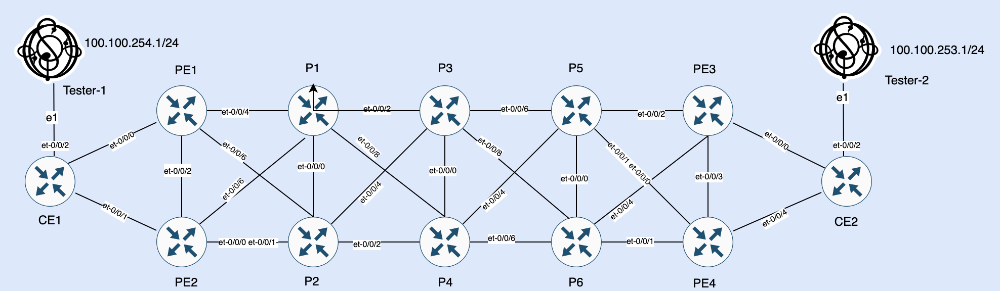

# Container-LSP

## Executive Summary
In previous two articles I have discussed in detail how to handle traffic congenstion  in MPLS backbone networks due to  increase  in traffic demand by using Faster Auto bandwidth adjustment (https://github.com/kashif-nawaz/MPLS-Auto-BW-Junos) and by deploying Class of Service CoS (https://github.com/kashif-nawaz/MPLS-Backbone-Class-Of-Service-Design-Principles) but those arrangements are sufficient to meet demand in traffic increase. In addition to faster auto bandwidth adjustment and CoS parallel LSPs are required between 2 PEs (ideally on distinct paths) so that traffic could load balanced over equal cost multipath links.  This combination will provide an ideal recipe to handle increasing traffic needs but it would add another challenge i.e always provisioned parallel LSP will add overhead in RSVP control plane by maintaining the RSVP reservation.  So is possible to optimize this solution in a way that par rale LSP should be created dynamically as per traffic needs, answer is yes , Traffic Engineering (TE++) or Container LSP solve this problem. It enables an operator to configure LSP template to be used to dynamically create parallel LSPs based on increasing traffic demand and once demands is reduced parallel LSP would be torn down. This arrangement will reduce control plane overhead caused by pre provisioned parallel LSPs. 

Juniper Networks has published an excellent white paper (https://www.juniper.net/assets/es/es/local/pdf/whitepapers/2000587-en.pdf) to define all the classical problems related to traffic load sharing in MPLS backbone network and how those problems would be addressed using Container LSP. But that paper does not talk about operative part and in this wiki I will endeavor to describe operative part of Container LSP.

## Important Terms and Definitions 
I have followed Juniper Networks official documentation (https://www.juniper.net/documentation/us/en/software/junos/mpls/topics/topic-map/container-lsp-configuration.html) to digest important terms and definitions. Container LSP has nominal LSP which is always present and supplementary LSPs which are created to handle increasing traffic demands and when traffic demands decrease supplementary LSPs are automatically pruned thus freeing up resources reservation which ultimately reduces control plane overhead. Process for adding up supplementary LSPs is called splitting and removing supplementary LSP is called merging. Both, splitting and merging happens at regular interval (which is called normalization interval) and decision to go  for splitting or merger is controlled by various config parameters  by considering Current-Aggr-Bw (which is sum of current reservation by all supplementary or member LSPs) and New-Aggr-Bw (which is sum of traffic rate on supplementary or member LSPs). 

## Lab Topology



## Config Components
### LSP Template 
A template is required to be configured with keyword "template" under protocol mpls hierarchy and that template will be inherited by nominal LSP and all supplementary LSPs. To get understanding of various parameters defined in following template, please read my article on faster autobandwitdh adjustment available on (https://github.com/kashif-nawaz/MPLS-Auto-BW-Junos). 

```
label-switched-path LSP_TEMPLATE {
    template;
    priority 5 5;
    optimize-timer 60;
    least-fill;
    node-link-protection;
    in-place-lsp-bandwidth-update;
    auto-bandwidth {
        adjust-interval 300;
        adjust-threshold 3;
        adjust-threshold-activate-bandwidth 25m;
        minimum-bandwidth 0;
        maximum-bandwidth 10g;
        adjust-threshold-overflow-limit 3;
        adjust-threshold-underflow-limit 3;
    }
}
```
### Contrainer LSP
Instead of configuring label-switch-path, container-label-switched-path config hirearchy is used under mpls hierarchy, e.g container LSP defination from PE1 to other PEs (lab topology is depicted  above) is appended below:-

```
protocols {
    mpls {
apply-groups CT_LSP;
icmp-tunneling;
ipv6-tunneling;
apply-groups CT_LSP;
container-label-switched-path PE1-to-PE2 {
    to 172.172.172.2;
}
container-label-switched-path PE1-to-PE3 {
    to 172.172.172.9;
}
container-label-switched-path PE1-to-PE4 {
    to 172.172.172.10;
}
}
}
```
I have created a Junos group CT_LSP to define container LPS paramters and applied it to protocols mpls. 

```
groups {
CT_LSP 
protocols {
    mpls {
        statistics {
            file auto-bw;
            interval 50;
            auto-bandwidth;
        }
        container-label-switched-path <PE*-to*> {
            label-switched-path-template {
                LSP_TEMPLATE;
            }
            splitting-merging {
                maximum-member-lsps 3;
                minimum-member-lsps 1;
                splitting-bandwidth 150m;
                merging-bandwidth 10m;
                maximum-signaling-bandwidth 10m;
                minimum-signaling-bandwidth 10m;
                splitting-merging-threshold 10;
                normalization {
                    normalize-interval 400;
                    failover-normalization;
                    normalization-retry-duration 60;
                    normalization-retry-limits 3;
                }
                sampling {
                    cut-off-threshold 1;
                    use-percentile 90;
                }
            }
        }
    }
}
}
```
Explaination about parameters used under splitting-merging hierarchy. 
* maximum-member-lsps , defines maximum number of LSPs created by splitting action.
* minimum-member-lsps , defines minimum number of LSPs that should remain active.
* splitting-bandwidth, defines the bandwitdh utilization limit to trigger splitting action. 
* merging-bandwidth, defines the lowest bandwitdh utilization limit  to trigger merg action.
* maximum-signaling-bandwidth, defines maximum bandwidth to be signalled for each member LSP. 
* minimum-signaling-bandwidth, defines minimum bandwidth to be signalled for each member LSP.
* splitting-merging-threshold , dicates how splitting and merging would happen by comparing New-Aggr-Bw and  Current-Aggr-Bw values. 
* normalization normalize-interval, defines time period after which LSP splitting / merger would happen.
* sampling , use-percentile specify the ingress route to take x prenctile value from all the bandwidth samples and use that for normalization. It is mutely exclusive to use-average-aggregate which means ingress router to take average of aggregate samples and use that for normalization.
* sampling, cut-off-threshold specifies the percentile value to be used as a cut-off threshold in removing outlier bandwidth samples.


### Operational Verification
CLI commands to inspect container LSPs is different than the normal LSP. Below output shows that PE1-to-PE3 has 3 instances and extensive output shows in depth information about split events. 

```
root@PE1> show mpls container-lsp ingress terse   

Ingress LSP: 3 sessions
Container LSP name                              State     Member LSP count
PE1-to-PE2                                      Up                1
PE1-to-PE3                                      Up                3
PE1-to-PE4                                      Up                1
Total 5 displayed, Up 5, Down 0


root@PE1> show mpls container-lsp ingress name PE1-to-PE3 

Ingress LSP: 3 sessions
Container LSP name                              State     Member LSP count
PE1-to-PE3                                      Up                3
To              From            State Rt P     ActivePath       LSPname
172.172.172.9   172.172.172.1   Up     0 *                      PE1-to-PE3-1
172.172.172.9   172.172.172.1   Up     0 *                      PE1-to-PE3-2
172.172.172.9   172.172.172.1   Up     0 *                      PE1-to-PE3-3
Total 3 displayed, Up 3, Down 0


root@PE1> show mpls container-lsp ingress name PE1-to-PE3 extensive 

Warning: License key missing; requires 'rsvp' license

Ingress LSP: 3 sessions
Container LSP name: PE1-to-PE3, State: Up, Member count: 3
 Normalization 
  Min LSPs: 1, Max LSPs: 3
  Aggregate bandwidth: 317.584Mbps, Sampled Aggregate bandwidth: 284.67Mbps
  NormalizeTimer: 400 secs, NormalizeThreshold: 10%
  Max Signaling BW: 10Mbps, Min Signaling BW: 10Mbps, Splitting BW: 150Mbps, Merging BW: 10Mbps
  Mode: incremental-normalization, failover-normalization
  Sampling: Outlier cut-off 1, Percentile 90 of Aggregate
  Normalization in 15 second(s)
   4512 Nov  5 05:38:27.331 Clear history and statistics: on container (PE1-to-PE3)
   4511 Nov  5 05:37:44.538 Avoid normalization: not needed as already running with max-members
   4510 Nov  5 05:37:44.538 Normalize: normalization with aggregate bandwidth 284195456 bps
   4509 Nov  5 05:31:22.270 Normalization complete: container (PE1-to-PE3) with 3 members 
   4508 Nov  5 05:31:04.787 Normalize: container (PE1-to-PE3) into 3 members - each with bandwidth 10000000 bps
   4507 Nov  5 05:31:04.787 Normalize: normalization with aggregate bandwidth 260575520 bps
   4506 Nov  5 05:25:25.885 Normalization complete: container (PE1-to-PE3) with 1 members 
   4505 Nov  5 05:25:25.787 Delete member LSPs: PE1-to-PE3-2 through PE1-to-PE3-3
   4504 Nov  5 05:25:25.786 Normalize: container (PE1-to-PE3) into 1 members - each with bandwidth 10000000 bps
   4503 Nov  5 05:25:25.786 Normalize: container (PE1-to-PE3) create 1 LSPs, min bw 10000000bps, member count 3
   4502 Nov  5 05:25:25.786 Normalize: normalization with aggregate bandwidth 0 bps
   4501 Nov  5 05:25:25.786 Normalize: container (PE1-to-PE3) received PathErr on member PE1-to-PE3-2[2 times, first Jan  1 00:00:00.000]
   4500 Nov  5 05:25:07.327 Clear history and statistics: on container (PE1-to-PE3)
   4499 Nov  5 05:24:24.965 Avoid normalization: not needed as already running with max-members
   4498 Nov  5 05:24:24.965 Normalize: normalization with aggregate bandwidth 279223840 bps
   4497 Nov  5 05:18:27.331 Clear history and statistics: on container (PE1-to-PE3)
   4496 Nov  5 05:17:45.228 Avoid normalization: not needed as already running with max-members
   4495 Nov  5 05:17:45.228 Normalize: normalization with aggregate bandwidth 290110080 bps
   4494 Nov  5 05:11:47.364 Clear history and statistics: on container (PE1-to-PE3)
   4493 Nov  5 05:11:06.137 Avoid normalization: not needed as already running with max-members
   4492 Nov  5 05:11:06.137 Normalize: normalization with aggregate bandwidth 285717888 bps
   4491 Nov  5 05:05:07.363 Clear history and statistics: on container (PE1-to-PE3)
   4490 Nov  5 05:04:26.840 Avoid normalization: not needed as already running with max-members
   4489 Nov  5 05:04:26.840 Normalize: normalization with aggregate bandwidth 265405248 bps
   4488 Nov  5 05:02:39.840 Avoid normalization: not needed as already running with max-members
   4487 Nov  5 05:02:39.840 Normalize: normalization with aggregate bandwidth 251297088 bps
   4486 Nov  5 05:02:39.840 Normalize: container (PE1-to-PE3) received PathErr on member PE1-to-PE3-3[2 times, first Jan  1 00:00:00.000]
   4485 Nov  5 04:58:27.362 Clear history and statistics: on container (PE1-to-PE3)
   4484 Nov  5 04:57:47.325 Avoid normalization: not needed as already running with max-members
   4483 Nov  5 04:57:47.325 Normalize: normalization with aggregate bandwidth 293721024 bps
   4482 Nov  5 04:51:47.338 Clear history and statistics: on container (PE1-to-PE3)
   4481 Nov  5 04:51:07.387 Avoid normalization: not needed as already running with max-members
   4480 Nov  5 04:51:07.387 Normalize: normalization with aggregate bandwidth 278256960 bps
   4479 Nov  5 04:45:07.367 Clear history and statistics: on container (PE1-to-PE3)
   4478 Nov  5 04:44:27.636 Avoid normalization: not needed as already running with max-members
   4477 Nov  5 04:44:27.636 Normalize: normalization with aggregate bandwidth 282361536 bps
   4476 Nov  5 04:38:27.364 Clear history and statistics: on container (PE1-to-PE3)
   4475 Nov  5 04:37:47.635 Avoid normalization: not needed as already running with max-members
   4474 Nov  5 04:37:47.635 Normalize: normalization with aggregate bandwidth 281329216 bps
   4473 Nov  5 04:35:43.635 Avoid normalization: not needed as already running with max-members
   4472 Nov  5 04:35:43.635 Normalize: normalization with aggregate bandwidth 289676480 bps
   4471 Nov  5 04:35:43.634 Normalize: container (PE1-to-PE3) received PathErr on member PE1-to-PE3-3[2 times, first Jan  1 00:00:00.000]
   4470 Nov  5 04:31:47.331 Clear history and statistics: on container (PE1-to-PE3)
   4469 Nov  5 04:31:08.091 Avoid normalization: not needed as already running with max-members
   4468 Nov  5 04:31:08.091 Normalize: normalization with aggregate bandwidth 273155200 bps
   4467 Nov  5 04:25:07.340 Clear history and statistics: on container (PE1-to-PE3)
   4466 Nov  5 04:24:28.090 Avoid normalization: not needed as already running with max-members
   4465 Nov  5 04:24:28.090 Normalize: normalization with aggregate bandwidth 273743104 bps
   4464 Nov  5 04:18:27.362 Clear history and statistics: on container (PE1-to-PE3)
   4463 Nov  5 04:17:48.090 Avoid normalization: not needed as already running with max-members

172.172.172.9
  From: 172.172.172.1, State: Up, ActiveRoute: 0, LSPname: PE1-to-PE3-1, LSPid: 30
  ActivePath:  (primary)
  Node/Link protection desired
  LSPtype: Dynamic Configured, Penultimate hop popping
  LoadBalance: Least-fill
  Follow destination IGP metric
  Autobandwidth 
  MaxBW: 10Gbps
  AdjustTimer: 300 secs AdjustThreshold: 3% 
  Adjust Threshold Activate Bandwidth: 25Mbps
  Max AvgBW util: 0bps, Bandwidth Adjustment in 21 second(s).
  Overflow limit: 3, Overflow sample count: 0
  Underflow limit: 3, Underflow sample count: 0, Underflow Max AvgBW: 0bps
  Encoding type: Packet, Switching type: Packet, GPID: IPv4
  LSP Self-ping Status : Enabled
 *Primary                    State: Up
    Priorities: 5 5
    Bandwidth: 10Mbps
    OptimizeTimer: 30
    SmartOptimizeTimer: 180
    Flap Count: 12
    MBB Count: 2069
    In-place Update Count: 0 (bandwidth), 0 (hold-priority)
    Reoptimization in 8 second(s).
    Computed ERO (S [L] denotes strict [loose] hops): (CSPF metric: 4)
 10.0.1.5 S 10.0.1.19 S 10.0.1.27 S 10.0.1.33 S 
    Received RRO (ProtectionFlag 1=Available 2=InUse 4=B/W 8=Node 10=SoftPreempt 20=Node-ID):
          172.172.172.4(flag=0x29) 10.0.1.5(flag=9 Label=11433) 172.172.172.6(flag=0x29) 10.0.1.19(flag=9 Label=7446) 172.172.172.7(flag=0x21) 10.0.1.27(flag=1 Label=2443) 172.172.172.9(flag=0x20) 10.0.1.33(Label=3)
   34938 Nov  5 05:43:48.441 CSPF: computation result ignored, new path no benefit[3 times, first Nov  5 05:42:54.790]
   34937 Nov  5 05:42:54.790 Originate make-before-break call: Add skipped CSPF run
   34936 Nov  5 05:42:54.790 Make-before-break: Cleaned up old instance: Hold dead expiry
   34935 Nov  5 05:42:49.644 Pending old path instance deletion[2 times, first Nov  5 05:42:20.414]
   34934 Nov  5 05:41:53.141 Record Route:  172.172.172.4(flag=0x29) 10.0.1.5(flag=9 Label=11433) 172.172.172.6(flag=0x29) 10.0.1.19(flag=9 Label=7446) 172.172.172.7(flag=0x21) 10.0.1.27(flag=1 Label=2443) 172.172.172.9(flag=0x20) 10.0.1.33(Label=3)
   34933 Nov  5 05:41:51.488 Pending old path instance deletion
   34932 Nov  5 05:41:49.367 Link-protection Up
   34931 Nov  5 05:41:48.584 Make-before-break: Switched to new instance
   34930 Nov  5 05:41:48.584 Link-protection Down
   34929 Nov  5 05:41:48.582 Self-ping ended successfully
   34928 Nov  5 05:41:39.789 Record Route:  172.172.172.4(flag=0x29) 10.0.1.5(flag=9 Label=11433) 172.172.172.6(flag=0x21) 10.0.1.19(flag=1 Label=7446) 172.172.172.7(flag=0x21) 10.0.1.27(flag=1 Label=2443) 172.172.172.9(flag=0x20) 10.0.1.33(Label=3)
   34927 Nov  5 05:41:38.382 Record Route:  172.172.172.4(flag=0x29) 10.0.1.5(flag=9 Label=11433) 172.172.172.6(flag=0x20) 10.0.1.19(Label=7446) 172.172.172.7(flag=0x21) 10.0.1.27(flag=1 Label=2443) 172.172.172.9(flag=0x20) 10.0.1.33(Label=3)
   34926 Nov  5 05:41:37.666 Record Route:  172.172.172.4(flag=0x20) 10.0.1.5(Label=11433) 172.172.172.6(flag=0x20) 10.0.1.19(Label=7446) 172.172.172.7(flag=0x21) 10.0.1.27(flag=1 Label=2443) 172.172.172.9(flag=0x20) 10.0.1.33(Label=3)
   34925 Nov  5 05:41:37.273 Up
   34924 Nov  5 05:41:37.273 Self-ping started
   34923 Nov  5 05:41:37.273 Self-ping enqueued
   34922 Nov  5 05:41:37.272 Record Route:  172.172.172.4(flag=0x20) 10.0.1.5(Label=11433) 172.172.172.6(flag=0x20) 10.0.1.19(Label=7446) 172.172.172.7(flag=0x20) 10.0.1.27(Label=2443) 172.172.172.9(flag=0x20) 10.0.1.33(Label=3)
   34921 Nov  5 05:41:21.921 Autobw adjustment succeeded due to normalization: BW changes from 260957504 bps to 10000000 bps
   34920 Nov  5 05:41:21.916 LSP-ID: 2104 created
   34919 Nov  5 05:41:21.916 Originate make-before-break call
   34918 Nov  5 05:41:21.916 CSPF: computation result accepted  10.0.1.5 10.0.1.19 10.0.1.27 10.0.1.33
   34917 Nov  5 05:41:21.916 CSPF: Reroute due to re-optimization
   34916 Nov  5 05:40:52.816 CSPF: computation result ignored, new path no benefit[20 times, first Nov  5 05:31:35.859]
   34915 Nov  5 05:31:22.270 Make-before-break: Cleaned up old instance: Hold dead expiry
   34914 Nov  5 05:31:06.475 Pending old path instance deletion[4 times, first Nov  5 05:30:09.094]
   34913 Nov  5 05:29:58.367 Link-protection Up
   34912 Nov  5 05:29:57.397 Make-before-break: Switched to new instance
   34911 Nov  5 05:29:57.397 Link-protection Down
   34910 Nov  5 05:29:57.395 Self-ping ended successfully
   34909 Nov  5 05:29:40.296 Record Route:  172.172.172.3(flag=0x29) 10.0.1.3(flag=9 Label=5423) 172.172.172.5(flag=0x29) 10.0.1.13(flag=9 Label=10751) 172.172.172.8(flag=0x21) 10.0.1.25(flag=1 Label=14841) 172.172.172.9(flag=0x20) 10.0.1.39(Label=3)
   34908 Nov  5 05:29:40.224 Record Route:  172.172.172.3(flag=0x20) 10.0.1.3(Label=5423) 172.172.172.5(flag=0x29) 10.0.1.13(flag=9 Label=10751) 172.172.172.8(flag=0x21) 10.0.1.25(flag=1 Label=14841) 172.172.172.9(flag=0x20) 10.0.1.39(Label=3)
   34907 Nov  5 05:29:40.098 Record Route:  172.172.172.3(flag=0x20) 10.0.1.3(Label=5423) 172.172.172.5(flag=0x29) 10.0.1.13(flag=9 Label=10751) 172.172.172.8(flag=0x20) 10.0.1.25(Label=14841) 172.172.172.9(flag=0x20) 10.0.1.39(Label=3)
   34906 Nov  5 05:29:39.693 Up
   34905 Nov  5 05:29:39.693 Automatic Autobw adjustment succeeded: BW changes from 10000000 bps to 260957504 bps
   34904 Nov  5 05:29:39.693 Self-ping started
   34903 Nov  5 05:29:39.693 Self-ping enqueued
   34902 Nov  5 05:29:39.693 Record Route:  172.172.172.3(flag=0x20) 10.0.1.3(Label=5423) 172.172.172.5(flag=0x20) 10.0.1.13(Label=10751) 172.172.172.8(flag=0x20) 10.0.1.25(Label=14841) 172.172.172.9(flag=0x20) 10.0.1.39(Label=3)
   34901 Nov  5 05:29:17.330 LSP-ID: 2103 created
   34900 Nov  5 05:29:17.330 Originate make-before-break call
   34899 Nov  5 05:29:17.330 CSPF: ERO retrace was successful  10.0.1.3 10.0.1.13 10.0.1.25 10.0.1.39
   34898 Nov  5 05:29:10.727 CSPF: computation result ignored, new path no benefit[5 times, first Nov  5 05:27:19.776]
   34897 Nov  5 05:27:19.775 Originate make-before-break call: Add skipped CSPF run
   34896 Nov  5 05:27:19.775 Make-before-break: Cleaned up old instance: Hold dead expiry
   34895 Nov  5 05:27:12.599 Pending old path instance deletion[2 times, first Nov  5 05:26:43.824]
   34894 Nov  5 05:26:23.310 Record Route:  172.172.172.3(flag=0x29) 10.0.1.3(flag=9 Label=5422) 172.172.172.5(flag=0x29) 10.0.1.13(flag=9 Label=10750) 172.172.172.8(flag=0x21) 10.0.1.25(flag=1 Label=14838) 172.172.172.9(flag=0x20) 10.0.1.39(Label=3)
   34893 Nov  5 05:26:17.093 Record Route:  172.172.172.3(flag=0x29) 10.0.1.3(flag=9 Label=5422) 172.172.172.5(flag=0x20) 10.0.1.13(Label=10750) 172.172.172.8(flag=0x21) 10.0.1.25(flag=1 Label=14838) 172.172.172.9(flag=0x20) 10.0.1.39(Label=3)
   34892 Nov  5 05:26:14.048 Pending old path instance deletion
   34891 Nov  5 05:25:58.368 Link-protection Up
   34890 Nov  5 05:25:57.770 Make-before-break: Switched to new instance
   34889 Nov  5 05:25:57.770 Link-protection Down
  Created: Wed Nov  1 07:00:47 2023

172.172.172.9
  From: 172.172.172.1, State: Up, ActiveRoute: 0, LSPname: PE1-to-PE3-2, LSPid: 132
  ActivePath:  (primary)
  Node/Link protection desired
  LSPtype: Dynamic Configured, Penultimate hop popping
  LoadBalance: Least-fill
  Follow destination IGP metric
  Autobandwidth 
  MaxBW: 10Gbps
  AdjustTimer: 300 secs AdjustThreshold: 3% 
  Adjust Threshold Activate Bandwidth: 25Mbps
  Max AvgBW util: 0bps, Bandwidth Adjustment in 201 second(s).
  Overflow limit: 3, Overflow sample count: 0
  Underflow limit: 3, Underflow sample count: 0, Underflow Max AvgBW: 0bps
  Encoding type: Packet, Switching type: Packet, GPID: IPv4
  LSP Self-ping Status : Enabled
 *Primary                    State: Up
    Priorities: 5 5
    Bandwidth: 10Mbps
    OptimizeTimer: 30
    SmartOptimizeTimer: 180
    Flap Count: 0
    MBB Count: 1
    In-place Update Count: 0 (bandwidth), 0 (hold-priority)
    Reoptimization in 0 second(s).
    Computed ERO (S [L] denotes strict [loose] hops): (CSPF metric: 4)
 10.0.1.5 S 10.0.1.19 S 10.0.1.27 S 10.0.1.33 S 
    Received RRO (ProtectionFlag 1=Available 2=InUse 4=B/W 8=Node 10=SoftPreempt 20=Node-ID):
          172.172.172.4(flag=0x29) 10.0.1.5(flag=9 Label=11434) 172.172.172.6(flag=0x29) 10.0.1.19(flag=9 Label=7447) 172.172.172.7(flag=0x21) 10.0.1.27(flag=1 Label=2444) 172.172.172.9(flag=0x20) 10.0.1.33(Label=3)
   30 Nov  5 05:43:40.783 Pending old path instance deletion
   29 Nov  5 05:43:29.366 Link-protection Up
   28 Nov  5 05:43:29.365 Make-before-break: Switched to new instance
   27 Nov  5 05:43:29.365 Link-protection Down
   26 Nov  5 05:43:29.363 Self-ping ended successfully
   25 Nov  5 05:43:23.049 Record Route:  172.172.172.4(flag=0x29) 10.0.1.5(flag=9 Label=11434) 172.172.172.6(flag=0x29) 10.0.1.19(flag=9 Label=7447) 172.172.172.7(flag=0x21) 10.0.1.27(flag=1 Label=2444) 172.172.172.9(flag=0x20) 10.0.1.33(Label=3)
   24 Nov  5 05:43:22.898 Record Route:  172.172.172.4(flag=0x20) 10.0.1.5(Label=11434) 172.172.172.6(flag=0x29) 10.0.1.19(flag=9 Label=7447) 172.172.172.7(flag=0x21) 10.0.1.27(flag=1 Label=2444) 172.172.172.9(flag=0x20) 10.0.1.33(Label=3)
   23 Nov  5 05:43:22.546 Record Route:  172.172.172.4(flag=0x20) 10.0.1.5(Label=11434) 172.172.172.6(flag=0x20) 10.0.1.19(Label=7447) 172.172.172.7(flag=0x21) 10.0.1.27(flag=1 Label=2444) 172.172.172.9(flag=0x20) 10.0.1.33(Label=3)
   22 Nov  5 05:43:22.467 Up
   21 Nov  5 05:43:22.467 Self-ping started
   20 Nov  5 05:43:22.467 Self-ping enqueued
   19 Nov  5 05:43:22.466 Record Route:  172.172.172.4(flag=0x20) 10.0.1.5(Label=11434) 172.172.172.6(flag=0x20) 10.0.1.19(Label=7447) 172.172.172.7(flag=0x20) 10.0.1.27(Label=2444) 172.172.172.9(flag=0x20) 10.0.1.33(Label=3)
   18 Nov  5 05:43:11.913 LSP-ID: 2 created
   17 Nov  5 05:43:11.913 Originate make-before-break call
   16 Nov  5 05:43:11.913 CSPF: computation result accepted  10.0.1.5 10.0.1.19 10.0.1.27 10.0.1.33
   15 Nov  5 05:43:11.913 CSPF: Reroute due to re-optimization
   14 Nov  5 05:42:43.396 CSPF: computation result ignored, new path no benefit[24 times, first Nov  5 05:31:33.892]
   13 Nov  5 05:31:22.368 Link-protection Up
   12 Nov  5 05:31:22.269 Selected as active path
   11 Nov  5 05:31:22.268 Self-ping ended successfully
   10 Nov  5 05:31:13.788 Record Route:  172.172.172.4(flag=0x29) 10.0.1.5(flag=9 Label=11426) 172.172.172.6(flag=0x29) 10.0.1.19(flag=9 Label=7442) 172.172.172.8(flag=0x21) 10.0.1.29(flag=1 Label=14843) 172.172.172.9(flag=0x20) 10.0.1.39(Label=3)
    9 Nov  5 05:31:13.389 Record Route:  172.172.172.4(flag=0x29) 10.0.1.5(flag=9 Label=11426) 172.172.172.6(flag=0x20) 10.0.1.19(Label=7442) 172.172.172.8(flag=0x21) 10.0.1.29(flag=1 Label=14843) 172.172.172.9(flag=0x20) 10.0.1.39(Label=3)
    8 Nov  5 05:31:12.997 Record Route:  172.172.172.4(flag=0x29) 10.0.1.5(flag=9 Label=11426) 172.172.172.6(flag=0x20) 10.0.1.19(Label=7442) 172.172.172.8(flag=0x20) 10.0.1.29(Label=14843) 172.172.172.9(flag=0x20) 10.0.1.39(Label=3)
    7 Nov  5 05:31:12.872 Up
    6 Nov  5 05:31:12.872 Self-ping started
    5 Nov  5 05:31:12.872 Self-ping enqueued
    4 Nov  5 05:31:12.872 Record Route:  172.172.172.4(flag=0x20) 10.0.1.5(Label=11426) 172.172.172.6(flag=0x20) 10.0.1.19(Label=7442) 172.172.172.8(flag=0x20) 10.0.1.29(Label=14843) 172.172.172.9(flag=0x20) 10.0.1.39(Label=3)
    3 Nov  5 05:31:04.788 LSP-ID: 1 created
    2 Nov  5 05:31:04.788 Originate Call
    1 Nov  5 05:31:04.788 CSPF: computation result accepted  10.0.1.5 10.0.1.19 10.0.1.29 10.0.1.39
  Created: Sun Nov  5 05:31:04 2023

172.172.172.9
  From: 172.172.172.1, State: Up, ActiveRoute: 0, LSPname: PE1-to-PE3-3, LSPid: 133
  ActivePath:  (primary)
  Node/Link protection desired
  LSPtype: Dynamic Configured, Penultimate hop popping
  LoadBalance: Least-fill
  Follow destination IGP metric
  Autobandwidth 
  MaxBW: 10Gbps
  AdjustTimer: 300 secs AdjustThreshold: 3% 
  Adjust Threshold Activate Bandwidth: 25Mbps
  Max AvgBW util: 297.584Mbps, Bandwidth Adjustment in 261 second(s).
  Overflow limit: 3, Overflow sample count: 0
  Underflow limit: 3, Underflow sample count: 0, Underflow Max AvgBW: 0bps
  Encoding type: Packet, Switching type: Packet, GPID: IPv4
  LSP Self-ping Status : Enabled
 *Primary                    State: Up
    Priorities: 5 5                     
    Bandwidth: 297.584Mbps
    OptimizeTimer: 30
    SmartOptimizeTimer: 180
    Flap Count: 0
    MBB Count: 0
    In-place Update Count: 4 (bandwidth), 0 (hold-priority)
    Reoptimization in 24 second(s).
    Computed ERO (S [L] denotes strict [loose] hops): (CSPF metric: 4)
 10.0.1.5 S 10.0.1.19 S 10.0.1.29 S 10.0.1.39 S 
    Received RRO (ProtectionFlag 1=Available 2=InUse 4=B/W 8=Node 10=SoftPreempt 20=Node-ID):
          172.172.172.4(flag=0x29) 10.0.1.5(flag=9 Label=11427) 172.172.172.6(flag=0x29) 10.0.1.19(flag=9 Label=7443) 172.172.172.8(flag=0x21) 10.0.1.29(flag=1 Label=14844) 172.172.172.9(flag=0x20) 10.0.1.39(Label=3)
   46 Nov  5 05:44:04.573 CSPF: computation result ignored, new path no benefit
   45 Nov  5 05:43:51.244 CSPF: computation result accepted  10.0.1.5 10.0.1.19 10.0.1.29 10.0.1.39
   44 Nov  5 05:43:51.243 Automatic Autobw adjustment succeeded: BW changes from 265758960 bps to 297584384 bps
   43 Nov  5 05:43:51.243 In-place LSP Update successful
   42 Nov  5 05:43:51.243 In-place Update Up
   41 Nov  5 05:43:34.929 In-place LSP Update pending, skip CSPF run
   40 Nov  5 05:43:31.163 Originate In-place LSP Update call
   39 Nov  5 05:43:31.163 CSPF: ERO retrace was successful  10.0.1.5 10.0.1.19 10.0.1.29 10.0.1.39
   38 Nov  5 05:43:06.398 CSPF: computation result ignored, new path no benefit[7 times, first Nov  5 05:40:16.773]
   37 Nov  5 05:39:48.008 CSPF: computation result accepted  10.0.1.5 10.0.1.19 10.0.1.29 10.0.1.39
   36 Nov  5 05:39:48.007 Automatic Autobw adjustment succeeded: BW changes from 290435680 bps to 265758960 bps
   35 Nov  5 05:39:48.007 In-place LSP Update successful
   34 Nov  5 05:39:48.007 In-place Update Up
   33 Nov  5 05:39:19.248 In-place LSP Update pending, skip CSPF run
   32 Nov  5 05:39:17.353 Originate In-place LSP Update call
   31 Nov  5 05:39:17.352 CSPF: ERO retrace was successful  10.0.1.5 10.0.1.19 10.0.1.29 10.0.1.39
   30 Nov  5 05:38:50.651 CSPF: computation result ignored, new path no benefit[4 times, first Nov  5 05:37:23.211]
   29 Nov  5 05:37:06.079 CSPF: computation result accepted  10.0.1.5 10.0.1.19 10.0.1.29 10.0.1.39
   28 Nov  5 05:37:06.078 Automatic Autobw adjustment succeeded: BW changes from 309126720 bps to 290435680 bps
   27 Nov  5 05:37:06.078 In-place LSP Update successful
   26 Nov  5 05:37:06.078 In-place Update Up
   25 Nov  5 05:36:54.080 In-place LSP Update pending, skip CSPF run
   24 Nov  5 05:36:47.356 Originate In-place LSP Update call
   23 Nov  5 05:36:47.356 CSPF: ERO retrace was successful  10.0.1.5 10.0.1.19 10.0.1.29 10.0.1.39
   22 Nov  5 05:36:24.501 CSPF: computation result ignored, new path no benefit[4 times, first Nov  5 05:34:57.057]
   21 Nov  5 05:34:36.931 CSPF: computation result accepted  10.0.1.5 10.0.1.19 10.0.1.29 10.0.1.39
   20 Nov  5 05:34:36.930 Automatic Autobw adjustment succeeded: BW changes from 10000000 bps to 309126720 bps
   19 Nov  5 05:34:36.930 In-place LSP Update successful
   18 Nov  5 05:34:36.930 In-place Update Up
   17 Nov  5 05:34:27.795 In-place LSP Update pending, skip CSPF run
   16 Nov  5 05:34:17.354 Originate In-place LSP Update call
   15 Nov  5 05:34:17.354 CSPF: ERO retrace was successful  10.0.1.5 10.0.1.19 10.0.1.29 10.0.1.39
   14 Nov  5 05:33:59.059 CSPF: computation result ignored, new path no benefit[6 times, first Nov  5 05:31:34.520]
   13 Nov  5 05:31:22.368 Link-protection Up
   12 Nov  5 05:31:22.270 Selected as active path
   11 Nov  5 05:31:22.269 Self-ping ended successfully
   10 Nov  5 05:31:13.788 Record Route:  172.172.172.4(flag=0x29) 10.0.1.5(flag=9 Label=11427) 172.172.172.6(flag=0x29) 10.0.1.19(flag=9 Label=7443) 172.172.172.8(flag=0x21) 10.0.1.29(flag=1 Label=14844) 172.172.172.9(flag=0x20) 10.0.1.39(Label=3)
    9 Nov  5 05:31:13.390 Record Route:  172.172.172.4(flag=0x29) 10.0.1.5(flag=9 Label=11427) 172.172.172.6(flag=0x20) 10.0.1.19(Label=7443) 172.172.172.8(flag=0x21) 10.0.1.29(flag=1 Label=14844) 172.172.172.9(flag=0x20) 10.0.1.39(Label=3)
    8 Nov  5 05:31:12.997 Record Route:  172.172.172.4(flag=0x29) 10.0.1.5(flag=9 Label=11427) 172.172.172.6(flag=0x20) 10.0.1.19(Label=7443) 172.172.172.8(flag=0x20) 10.0.1.29(Label=14844) 172.172.172.9(flag=0x20) 10.0.1.39(Label=3)
    7 Nov  5 05:31:12.872 Up
    6 Nov  5 05:31:12.872 Self-ping started
    5 Nov  5 05:31:12.872 Self-ping enqueued
    4 Nov  5 05:31:12.872 Record Route:  172.172.172.4(flag=0x20) 10.0.1.5(Label=11427) 172.172.172.6(flag=0x20) 10.0.1.19(Label=7443) 172.172.172.8(flag=0x20) 10.0.1.29(Label=14844) 172.172.172.9(flag=0x20) 10.0.1.39(Label=3)
    3 Nov  5 05:31:04.789 LSP-ID: 1 created
    2 Nov  5 05:31:04.789 Originate Call
    1 Nov  5 05:31:04.789 CSPF: computation result accepted  10.0.1.5 10.0.1.19 10.0.1.29 10.0.1.39
  Created: Sun Nov  5 05:31:04 2023
Total 3 displayed, Up 3, Down 0

root@PE1> show mpls container-lsp ingress name PE1-to-PE3 detail       

Warning: License key missing; requires 'rsvp' license

Ingress LSP: 3 sessions
Container LSP name: PE1-to-PE3, State: Up, Member count: 3
 Normalization 
  Min LSPs: 1, Max LSPs: 3
  Aggregate bandwidth: 317.584Mbps, Sampled Aggregate bandwidth: 281.983Mbps
  NormalizeTimer: 400 secs, NormalizeThreshold: 10%
  Max Signaling BW: 10Mbps, Min Signaling BW: 10Mbps, Splitting BW: 150Mbps, Merging BW: 10Mbps
  Mode: incremental-normalization, failover-normalization
  Sampling: Outlier cut-off 1, Percentile 90 of Aggregate
  Normalization in 6 second(s)
   4512 Nov  5 05:38:27.331 Clear history and statistics: on container (PE1-to-PE3)
   4511 Nov  5 05:37:44.538 Avoid normalization: not needed as already running with max-members
   4510 Nov  5 05:37:44.538 Normalize: normalization with aggregate bandwidth 284195456 bps
   4509 Nov  5 05:31:22.270 Normalization complete: container (PE1-to-PE3) with 3 members 
   4508 Nov  5 05:31:04.787 Normalize: container (PE1-to-PE3) into 3 members - each with bandwidth 10000000 bps
   4507 Nov  5 05:31:04.787 Normalize: normalization with aggregate bandwidth 260575520 bps
   4506 Nov  5 05:25:25.885 Normalization complete: container (PE1-to-PE3) with 1 members 
   4505 Nov  5 05:25:25.787 Delete member LSPs: PE1-to-PE3-2 through PE1-to-PE3-3
   4504 Nov  5 05:25:25.786 Normalize: container (PE1-to-PE3) into 1 members - each with bandwidth 10000000 bps
   4503 Nov  5 05:25:25.786 Normalize: container (PE1-to-PE3) create 1 LSPs, min bw 10000000bps, member count 3
   4502 Nov  5 05:25:25.786 Normalize: normalization with aggregate bandwidth 0 bps
   4501 Nov  5 05:25:25.786 Normalize: container (PE1-to-PE3) received PathErr on member PE1-to-PE3-2[2 times, first Jan  1 00:00:00.000]
   4500 Nov  5 05:25:07.327 Clear history and statistics: on container (PE1-to-PE3)
   4499 Nov  5 05:24:24.965 Avoid normalization: not needed as already running with max-members
   4498 Nov  5 05:24:24.965 Normalize: normalization with aggregate bandwidth 279223840 bps
   4497 Nov  5 05:18:27.331 Clear history and statistics: on container (PE1-to-PE3)
   4496 Nov  5 05:17:45.228 Avoid normalization: not needed as already running with max-members
   4495 Nov  5 05:17:45.228 Normalize: normalization with aggregate bandwidth 290110080 bps
   4494 Nov  5 05:11:47.364 Clear history and statistics: on container (PE1-to-PE3)
   4493 Nov  5 05:11:06.137 Avoid normalization: not needed as already running with max-members
   4492 Nov  5 05:11:06.137 Normalize: normalization with aggregate bandwidth 285717888 bps
   4491 Nov  5 05:05:07.363 Clear history and statistics: on container (PE1-to-PE3)
   4490 Nov  5 05:04:26.840 Avoid normalization: not needed as already running with max-members
   4489 Nov  5 05:04:26.840 Normalize: normalization with aggregate bandwidth 265405248 bps
   4488 Nov  5 05:02:39.840 Avoid normalization: not needed as already running with max-members
   4487 Nov  5 05:02:39.840 Normalize: normalization with aggregate bandwidth 251297088 bps
   4486 Nov  5 05:02:39.840 Normalize: container (PE1-to-PE3) received PathErr on member PE1-to-PE3-3[2 times, first Jan  1 00:00:00.000]
   4485 Nov  5 04:58:27.362 Clear history and statistics: on container (PE1-to-PE3)
   4484 Nov  5 04:57:47.325 Avoid normalization: not needed as already running with max-members
   4483 Nov  5 04:57:47.325 Normalize: normalization with aggregate bandwidth 293721024 bps
   4482 Nov  5 04:51:47.338 Clear history and statistics: on container (PE1-to-PE3)
   4481 Nov  5 04:51:07.387 Avoid normalization: not needed as already running with max-members
   4480 Nov  5 04:51:07.387 Normalize: normalization with aggregate bandwidth 278256960 bps
   4479 Nov  5 04:45:07.367 Clear history and statistics: on container (PE1-to-PE3)
   4478 Nov  5 04:44:27.636 Avoid normalization: not needed as already running with max-members
   4477 Nov  5 04:44:27.636 Normalize: normalization with aggregate bandwidth 282361536 bps
   4476 Nov  5 04:38:27.364 Clear history and statistics: on container (PE1-to-PE3)
   4475 Nov  5 04:37:47.635 Avoid normalization: not needed as already running with max-members
   4474 Nov  5 04:37:47.635 Normalize: normalization with aggregate bandwidth 281329216 bps
   4473 Nov  5 04:35:43.635 Avoid normalization: not needed as already running with max-members
   4472 Nov  5 04:35:43.635 Normalize: normalization with aggregate bandwidth 289676480 bps
   4471 Nov  5 04:35:43.634 Normalize: container (PE1-to-PE3) received PathErr on member PE1-to-PE3-3[2 times, first Jan  1 00:00:00.000]
   4470 Nov  5 04:31:47.331 Clear history and statistics: on container (PE1-to-PE3)
   4469 Nov  5 04:31:08.091 Avoid normalization: not needed as already running with max-members
   4468 Nov  5 04:31:08.091 Normalize: normalization with aggregate bandwidth 273155200 bps
   4467 Nov  5 04:25:07.340 Clear history and statistics: on container (PE1-to-PE3)
   4466 Nov  5 04:24:28.090 Avoid normalization: not needed as already running with max-members
   4465 Nov  5 04:24:28.090 Normalize: normalization with aggregate bandwidth 273743104 bps
   4464 Nov  5 04:18:27.362 Clear history and statistics: on container (PE1-to-PE3)
   4463 Nov  5 04:17:48.090 Avoid normalization: not needed as already running with max-members

172.172.172.9
  From: 172.172.172.1, State: Up, ActiveRoute: 0, LSPname: PE1-to-PE3-1, LSPid: 30
  ActivePath:  (primary)
  Node/Link protection desired
  LSPtype: Dynamic Configured, Penultimate hop popping
  LoadBalance: Least-fill
  Follow destination IGP metric
  Autobandwidth 
  MaxBW: 10Gbps
  AdjustTimer: 300 secs AdjustThreshold: 3% 
  Adjust Threshold Activate Bandwidth: 25Mbps
  Max AvgBW util: 0bps, Bandwidth Adjustment in 12 second(s).
  Overflow limit: 3, Overflow sample count: 0
  Underflow limit: 3, Underflow sample count: 0, Underflow Max AvgBW: 0bps
  Encoding type: Packet, Switching type: Packet, GPID: IPv4
  LSP Self-ping Status : Enabled
 *Primary                    State: Up
    Priorities: 5 5
    Bandwidth: 10Mbps
    OptimizeTimer: 30
    SmartOptimizeTimer: 180
    Flap Count: 12
    MBB Count: 2069
    In-place Update Count: 0 (bandwidth), 0 (hold-priority)
    Reoptimization in 0 second(s).
    Computed ERO (S [L] denotes strict [loose] hops): (CSPF metric: 4)
 10.0.1.5 S 10.0.1.19 S 10.0.1.27 S 10.0.1.33 S 
    Received RRO (ProtectionFlag 1=Available 2=InUse 4=B/W 8=Node 10=SoftPreempt 20=Node-ID):
          172.172.172.4(flag=0x29) 10.0.1.5(flag=9 Label=11433) 172.172.172.6(flag=0x29) 10.0.1.19(flag=9 Label=7446) 172.172.172.7(flag=0x21) 10.0.1.27(flag=1 Label=2443) 172.172.172.9(flag=0x20) 10.0.1.33(Label=3)

172.172.172.9
  From: 172.172.172.1, State: Up, ActiveRoute: 0, LSPname: PE1-to-PE3-2, LSPid: 132
  ActivePath:  (primary)
  Node/Link protection desired
  LSPtype: Dynamic Configured, Penultimate hop popping
  LoadBalance: Least-fill
  Follow destination IGP metric
  Autobandwidth 
  MaxBW: 10Gbps
  AdjustTimer: 300 secs AdjustThreshold: 3% 
  Adjust Threshold Activate Bandwidth: 25Mbps
  Max AvgBW util: 0bps, Bandwidth Adjustment in 192 second(s).
  Overflow limit: 3, Overflow sample count: 0
  Underflow limit: 3, Underflow sample count: 0, Underflow Max AvgBW: 0bps
  Encoding type: Packet, Switching type: Packet, GPID: IPv4
  LSP Self-ping Status : Enabled
 *Primary                    State: Up
    Priorities: 5 5
    Bandwidth: 10Mbps
    OptimizeTimer: 30
    SmartOptimizeTimer: 180
    Flap Count: 0
    MBB Count: 1
    In-place Update Count: 0 (bandwidth), 0 (hold-priority)
    Reoptimization in 20 second(s).
    Computed ERO (S [L] denotes strict [loose] hops): (CSPF metric: 4)
 10.0.1.5 S 10.0.1.19 S 10.0.1.27 S 10.0.1.33 S 
    Received RRO (ProtectionFlag 1=Available 2=InUse 4=B/W 8=Node 10=SoftPreempt 20=Node-ID):
          172.172.172.4(flag=0x29) 10.0.1.5(flag=9 Label=11434) 172.172.172.6(flag=0x29) 10.0.1.19(flag=9 Label=7447) 172.172.172.7(flag=0x21) 10.0.1.27(flag=1 Label=2444) 172.172.172.9(flag=0x20) 10.0.1.33(Label=3)

172.172.172.9
  From: 172.172.172.1, State: Up, ActiveRoute: 0, LSPname: PE1-to-PE3-3, LSPid: 133
  ActivePath:  (primary)
  Node/Link protection desired
  LSPtype: Dynamic Configured, Penultimate hop popping
  LoadBalance: Least-fill
  Follow destination IGP metric
  Autobandwidth 
  MaxBW: 10Gbps
  AdjustTimer: 300 secs AdjustThreshold: 3% 
  Adjust Threshold Activate Bandwidth: 25Mbps
  Max AvgBW util: 265.445Mbps, Bandwidth Adjustment in 252 second(s).
  Overflow limit: 3, Overflow sample count: 0
  Underflow limit: 3, Underflow sample count: 1, Underflow Max AvgBW: 265.445Mbps
  Encoding type: Packet, Switching type: Packet, GPID: IPv4
  LSP Self-ping Status : Enabled
 *Primary                    State: Up
    Priorities: 5 5
    Bandwidth: 297.584Mbps
    OptimizeTimer: 30
    SmartOptimizeTimer: 180
    Flap Count: 0
    MBB Count: 0
    In-place Update Count: 4 (bandwidth), 0 (hold-priority)
    Reoptimization in 16 second(s).
    Computed ERO (S [L] denotes strict [loose] hops): (CSPF metric: 4)
 10.0.1.5 S 10.0.1.19 S 10.0.1.29 S 10.0.1.39 S 
    Received RRO (ProtectionFlag 1=Available 2=InUse 4=B/W 8=Node 10=SoftPreempt 20=Node-ID):
          172.172.172.4(flag=0x29) 10.0.1.5(flag=9 Label=11427) 172.172.172.6(flag=0x29) 10.0.1.19(flag=9 Label=7443) 172.172.172.8(flag=0x21) 10.0.1.29(flag=1 Label=14844) 172.172.172.9(flag=0x20) 10.0.1.39(Label=3)
Total 3 displayed, Up 3, Down 0
```
